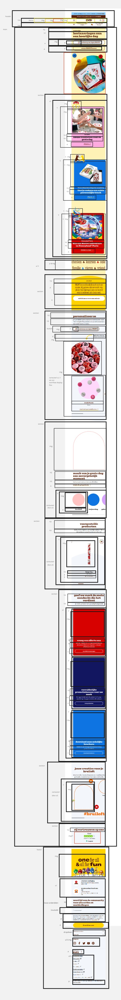
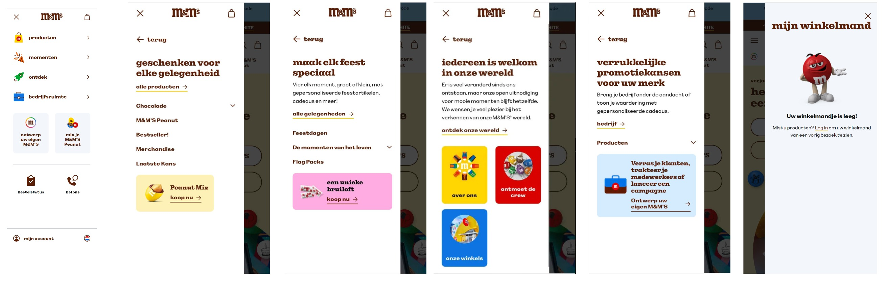

# Procesverslag
Markdown is een simpele manier om HTML te schrijven.  
Markdown cheat cheet: [Hulp bij het schrijven van Markdown](https://github.com/adam-p/markdown-here/wiki/Markdown-Cheatsheet).

Nb. De standaardstructuur en de spartaanse opmaak van de README.md zijn helemaal prima. Het gaat om de inhoud van je procesverslag. Besteedt de tijd voor pracht en praal aan je website.

Nb. Door *open* toe te voegen aan een *details* element kun je deze standaard open zetten. Fijn om dat steeds voor de relevante stuk(ken) te doen.

## Jij

  
uitwerken voor kick-off werkgroep

  ### Auteur:
  Sam van Crimpen

  #### Je startniveau:
  blauw

  #### Je focus:
 responsive
 

## Je website

  
uitwerken voor kick-off werkgroep

  ### Je opdracht:
  link naar de website die je gaat namaken óf de naam/omschrijving van je eigen ontwerp
  https://www.mms.com/nl-nl?gclid=CjwKCAjw3P-2BhAEEiwA3yPhwHhvWN4N0qFxfYisTy-9rLNvce2CtiWp27-jqr10bQTVnrAixAN5ChoCKwEQAvD_BwE

  #### Screenshot(s) van de eerste pagina (small screen): 
  main pagina
  

  #### Screenshot(s) van de tweede pagina (small screen):
  hier de naam van de pagina  
  
 

## Toegankelijkheidstest 1/2 (week 1)
  ### Bevindingen
  Lijst met je bevindingen die in de test naar voren kwamen:

  
uitwerken na test in 2e werkgroep

de screenreader las METER&M'S in plaats van m&m's
door twee keer op de pijltjestoets te tikken, ging ie van vertellen over menu naar klikken op menu. ik weet niet of ik dit zelf handig zou vinden.
de screenreader beschreef de afbeelding voordat hij vertelede waar de knop naartoe zou leiden: ÄFBEELDING, HARTJES GEVULD MET RODE EN WITTE M&M'S
hij vertelde ook over een afbeelding die helemaal geen link was, hierdoor was er geen onderscheid te horen tussen een afbeeldingsknop en een normale afbeelding.
de "ontwerp je eigen m&m pagina" is ontbruikbaar voor mensen die een screenreader gebruiken.
er miste op de homepagina een aantal screenreader prompts.
er zit een bewegend element, die beweegt tijdens het scrollen(in ieder geval op de laptop versie) deze word per woord voorgelezen, een slechtziende krijgt dus geen volledige ervaring van wat er getoond word op het scherm.
sommige teksten waren in het engels
de plaatjes die geen knoppen zijn werden naarmate je verder op de pagina was steeds vervelender om mee te werken (item heeft geen primaire actie).
er werd niks in detail verteld over de afbeeldingen. "design verjaardagsmix" "design bruiloft mix" 
de knop stond elke keer aan de onderkant, je moest elke keer door meerdere teksten en afbeeldingen heenscrollen.
bij een carrousel menu ging de narrator steeds de vorige afbeelding uitleggen, daardoor wist ik niet meer waar ik was.
er was soms wel uitleg van wat er te zien was, :buisje m&m's, prijs 3,50/stuk
iets bestellen op een productpagina was eigenlijk praktisch onmogelijk, ik moest door heel veel dingen scrollen voordat ik de koopknop had gevonden.
er waren op de website steeds stukjes in het engels en in het nederlands.
alle knoppen en tekst werden apart verteld, je moest elke keer 3 keer doortikken voordat je bij de knop uitkwam
er was niet meteen duidelijk wat een knop was en wat niet, wat navigeren moeilijk maakt. 
je kan ook je eigen pakken smaenstellen, en de eigen kleur m&M kiezen. dit menu was ook weer lastig te bedienen.
"item heeft geen eigen functie"

## Breakdownschets (week 1)
<a href="https://miro.com/app/board/uXjVLdggZVo=/?share_link_id=460490364818">miro board link met uitwekringen 1e pagina</a>

  
uitwerken na afloop 3e werkgroep

  ### de hele pagina: 
  

  ### dynamisch deel (bijv menu): 
  

  ### wellicht nog een dynamisch deel (bijv filter): 
  
    <a href="https://miro.com/app/board/uXjVLdggZVo=/?share_link_id=460490364818">miro board link met uitwekringen 1e pagina</a>

## Voortgang 1 (week 2)

  
uitwerken voor 1e voortgang

  ### Stand van zaken
  hier dit ging goed & dit was lastig (neem ook screenshots op van delen van je website en code)
  ik had door mijn minor heel weinig tijd om wat neer te zetten voor deze eerste werkgroep.

  ### Agenda voor meeting
  samen met je groepje opstellen

  | student 1      | student 2          | student 3    | student 4        |
  | ---            | ---                | ---          | ---              |
  | dit bespreken  | en dit             | en ik dit    | en dan ik dat    |
  | en dat ook nog | dit als er tijd is | nog een punt | dit wil ik zeker |
  | ...            | ...                | ...          | ...              |

  ### Verslag van meeting
  hier na afloop snel de uitkomsten van de meeting vastleggen

  - punt 1
  - punt 2
  - nog een punt
  - ...

  a11y goede plek om accessibility info te vinden
  alistapart.com article now you see mee over hoe je dingen kan verbergen
  naar een andere pagina is een link
aria label voor iets onzichtbaars, bijvoorbeeld specifieke knop (shop now tshirts ipv shop now)
zorg dat de code is geschreven voor screenreader, tekst bovenaan etc etc
lijstje met social media is ook een nav 
mdn is altijd up to date voor html dingen!

## Voortgang 2 (week 3)

  
uitwerken voor 2e voortgang

  ### Stand van zaken
  hier dit ging goed & dit was lastig (neem ook screenshots op van delen van je website en code)

  ### Agenda voor meeting
  samen met je groepje opstellen

  | student 1      | student 2          | student 3    | student 4        |
  | ---            | ---                | ---          | ---              |
  | dit bespreken  | en dit             | en ik dit    | en dan ik dat    |
  | en dat ook nog | dit als er tijd is | nog een punt | dit wil ik zeker |
  | ...            | ...                | ...          | ...              |

  ### Verslag van meeting
  hier na afloop snel de uitkomsten van de meeting vastleggen

  - punt 1
  - punt 2
  - nog een punt
- ...

## Toegankelijkheidstest 2/2 (week 4)

  
uitwerken na test in 9e werkgroep

  ### Bevindingen
  Lijst met je bevindingen die in de test naar voren kwamen (geef ook aan wat er verbeterd is):

## Voortgang 3 (week 4)

  
uitwerken voor 3e voortgang

  ### Stand van zaken
  hier dit ging goed & dit was lastig (neem ook screenshots op van delen van je website en code)
  zet placeholders als images voordat je er daadwerkelijke images in zet? 
  door flex komt een ul naast elkaar

  ### Agenda voor meeting
  samen met je groepje opstellen

  | student 1      | student 2          | student 3    | student 4        |
  | ---            | ---                | ---          | ---              |
  | dit bespreken  | en dit             | en ik dit    | en dan ik dat    |
  | en dat ook nog | dit als er tijd is | nog een punt | dit wil ik zeker |
  | ...            | ...                | ...          | ...              |

  ### Verslag van meeting
  hier na afloop snel de uitkomsten van de meeting vastleggen

  - punt 1
  - punt 2
  - nog een punt
  - ...

## Eindgesprek (week 5)

  
uitwerken voor eindgesprek

  ### Je uitkomst - karakteristiek screenshots:
  

  ### Dit ging goed/Heb ik geleerd: 
  Eigenlijk heb ik in een hele korte tijd een heleboel uitgevogeld. ik snap er nog steeds niet megaveel van, maar ik ben in ieder geval trots op hoe ver ik tot nu toe ben gekomen. ik heb geleerd hoe ik dingen beter kan opzoeken, en om door te zetten als iets niet meteen lukt. 
  ik had vorig jaar een irrationele angst voor het vak opgebouwd, naast dat ik niet lekker in mijn vel zat en daardoor geen energie in het vak kon steken.
  dit jaar deed ik dit vak tegelijk met mijn minor, wat ook veel energie kostte. 
  uiteindelijk heb ik in de vakantie voor de deadline heel veel wek kunnen verzetten en heb ik er veel uren ingestopt, hier ben ik ook trots op.

  

  ### Dit was lastig/Is niet gelukt:
  Korte omschrijving met plaatjes

  

## Bronnenlijst

  
continu bijhouden terwijl je werkt

  Nb. Wees specifiek ('css-tricks' als bron is bijv. niet specifiek genoeg). 
  Nb. ChatGpT en andere AI horen er ook bij.
  Nb. Vermeld de bronnen ook in je code.

  1. Laura en Diya
  2. https://www.w3schools.com/howto/howto_css_custom_scrollbar.asp
  3. https://developer.mozilla.org/en-US/docs/Web/CSS/border-top-left-radius
  4. 

